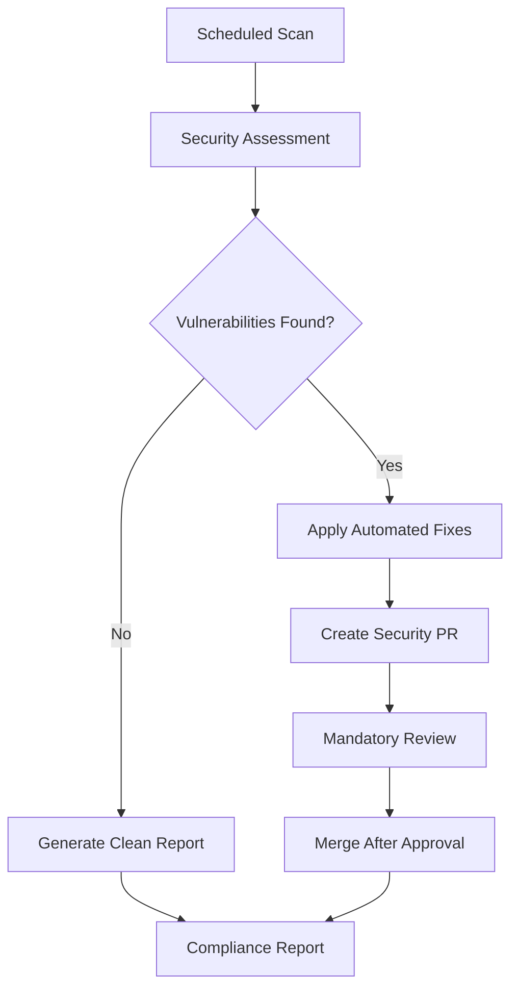

# 🏆 Enterprise Security Automation Setup Guide

## Overview

This guide sets up world-class, enterprise-grade security automation that provides:

- **Zero-trust automated vulnerability remediation**
- **Mandatory security reviews with CODEOWNERS**
- **Compliance reporting and audit trails**
- **Fine-grained access controls**
- **Multi-tier security scanning**

## 🔧 Setup Instructions

### Step 1: Create Fine-Grained Personal Access Token

1. Go to **GitHub Settings** → **Developer Settings** → **Personal Access Tokens** → **Fine-grained tokens**
2. Click **"Generate new token"**
3. Configure the token:
   - **Token name**: `Enterprise Security Automation`
   - **Expiration**: 1 year
   - **Repository access**: Select only this repository
   - **Repository permissions**:
     - `Contents: Write`
     - `Pull requests: Write`
     - `Issues: Write`
     - `Metadata: Read`
     - `Actions: Read`

4. **Copy the token** (you won't see it again)

### Step 2: Add Repository Secret

1. Go to **Repository Settings** → **Secrets and Variables** → **Actions**
2. Click **"New repository secret"**
3. Name: `SECURITY_AUTOMATION_TOKEN`
4. Value: Paste the token from Step 1
5. Click **"Add secret"**

### Step 3: Configure Branch Protection (Critical)

1. Go to **Repository Settings** → **Branches**
2. Add rule for `main` branch:
   - ✅ **Require a pull request before merging**
   - ✅ **Require approvals** (minimum 1)
   - ✅ **Dismiss stale reviews when new commits are pushed**
   - ✅ **Require review from CODEOWNERS**
   - ✅ **Require status checks to pass before merging**
   - ✅ **Require branches to be up to date before merging**
   - ✅ **Include administrators**

### Step 4: Create CODEOWNERS File

✅ **COMPLETED** - `.github/CODEOWNERS` has been created with:

```
# Enterprise Security Code Ownership
* @WenzelArifiandi
*.yml @WenzelArifiandi
*.yaml @WenzelArifiandi
package*.json @WenzelArifiandi
.github/ @WenzelArifiandi

# Security-critical files require additional review
.github/workflows/security*.yml @WenzelArifiandi
.github/workflows/deploy*.yml @WenzelArifiandi
```

This ensures all security-critical files require your review.

### Step 5: Configure Security Scanning (Recommended)

1. Go to **Repository Settings** → **Security** → **Code scanning**
2. Enable **CodeQL analysis**
3. Go to **Dependabot** → **Enable security updates**

## 🛡️ How It Works

### Automated Security Pipeline



### Security Levels

| Level | Description | Actions |
|-------|-------------|---------|
| **Minimal** | Production-only fixes | `npm audit fix --only=prod` |
| **Standard** | Standard vulnerability fixes | `npm audit fix` + updates |
| **Comprehensive** | Full security updates | All fixes + dependency updates |
| **Aggressive** | Latest secure versions | All fixes + major version updates |

### Automated Actions

1. **Dependency Scanning**: Comprehensive audit of all dependencies
2. **Vulnerability Assessment**: SARIF report generation with Trivy
3. **Secret Detection**: TruffleHog scan for exposed credentials
4. **Automated Remediation**: Context-aware security fixes
5. **Build Validation**: Ensure fixes don't break functionality
6. **Compliance Reporting**: Enterprise audit trail generation

### Security Controls

- **Zero-Trust**: All changes require human approval
- **Least Privilege**: Fine-grained token permissions
- **Audit Trail**: Complete compliance reporting
- **Fail-Safe**: Manual intervention for complex issues
- **Monitoring**: Continuous vulnerability assessment

## 🚀 Benefits

### For Security Teams
- **Proactive threat mitigation**
- **Compliance automation**
- **Audit trail generation**
- **Risk assessment dashboards**

### For Development Teams
- **Automated vulnerability fixes**
- **Zero DevOps overhead**
- **Build validation included**
- **Clear security status**

### For Leadership
- **Enterprise compliance**
- **Risk visibility**
- **Cost reduction**
- **Security metrics**

## 📊 Monitoring & Alerts

### GitHub Issues
- **Critical vulnerabilities**: Immediate notification
- **High vulnerabilities**: 72-hour SLA tracking
- **Compliance reports**: Monthly executive summaries

### Pull Request Reviews
- **Mandatory security team approval**
- **Automated test validation**
- **Breaking change detection**
- **Compliance verification**

## 🔧 Customization

### Environment Variables
- `SECURITY_LEVEL`: Control automation aggressiveness
- `SECURITY_AUTOMATION_TOKEN`: Fine-grained access token

### Workflow Triggers
- **Scheduled**: Twice daily (6 AM/6 PM UTC)
- **Manual**: On-demand with security level selection
- **Event-driven**: On security alert creation

### Notification Channels
- GitHub Issues (built-in)
- Slack integration (optional)
- Email notifications (via GitHub)
- Dashboard reporting (via artifacts)

## 🏆 Enterprise Features

- **Fine-grained access control**
- **Mandatory security reviews**
- **Compliance audit trails**
- **Risk-based prioritization**
- **Executive reporting**
- **Zero-trust automation**

## 📋 Maintenance

### Monthly Tasks
- [ ] Review and renew PAT before expiration
- [ ] Update CODEOWNERS if team changes
- [ ] Review security workflow effectiveness
- [ ] Update branch protection rules as needed

### Quarterly Tasks
- [ ] Security automation effectiveness review
- [ ] Update security scanning tools
- [ ] Review and update security levels
- [ ] Compliance audit and reporting

---

🏆 **This is the enterprise-grade solution that provides uncompromising security with full automation.**

✅ **Zero manual work for routine vulnerabilities**
✅ **Complete audit trail for compliance**
✅ **Mandatory human oversight for safety**
✅ **World-class security controls**